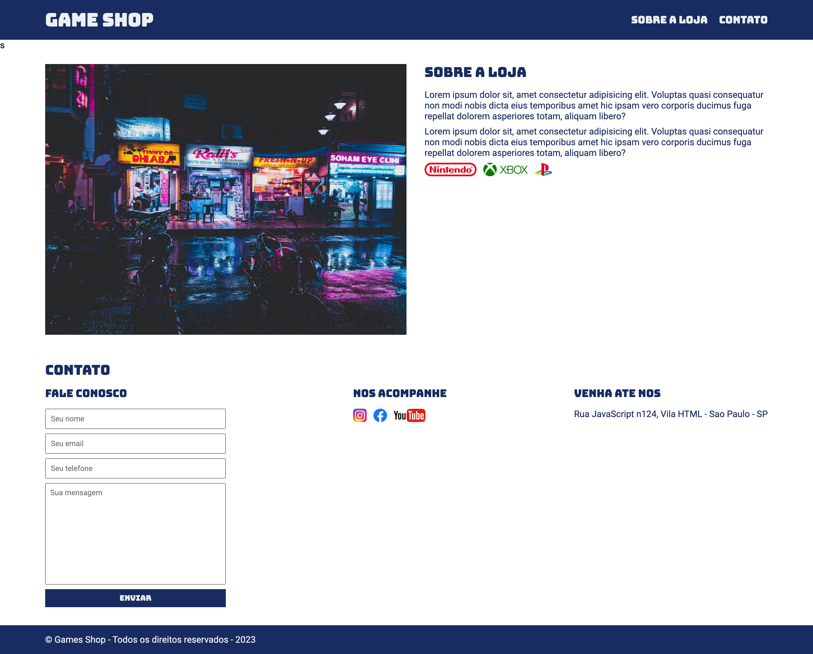

<h4>:open_book: EBAC - Escola Britânica de Artes Criativas e Tecnologia 
    💻 Front-End Software Engineering
</h4>

<h1>🎮 Game Shop 🎮</h1>

    Welcome to the Game Shop GitHub repository! 
    This repository contains the code for a game shop page, where users can explore and learn more about the store, its products, and get in touch with the team.
    
  

<h3>:rocket: Getting Started</h3>

To access the Game Shop page, follow these steps: 

1. Clone the repository to your local machine. 
2. After cloning the repository, open the index.html file in your web browser to view the game shop page.  

<h3> Built with </h3>

• HTML5 
• CSS3 
• Google Fonts 
    Bungee 
    Roboto 

Feel free to explore the code and customize it according to your needs. 

👾 Happy gaming! 👾

