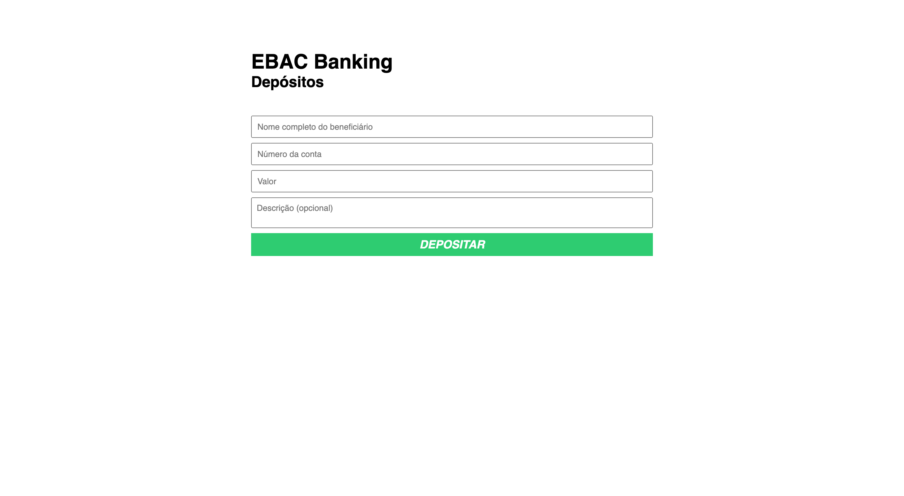
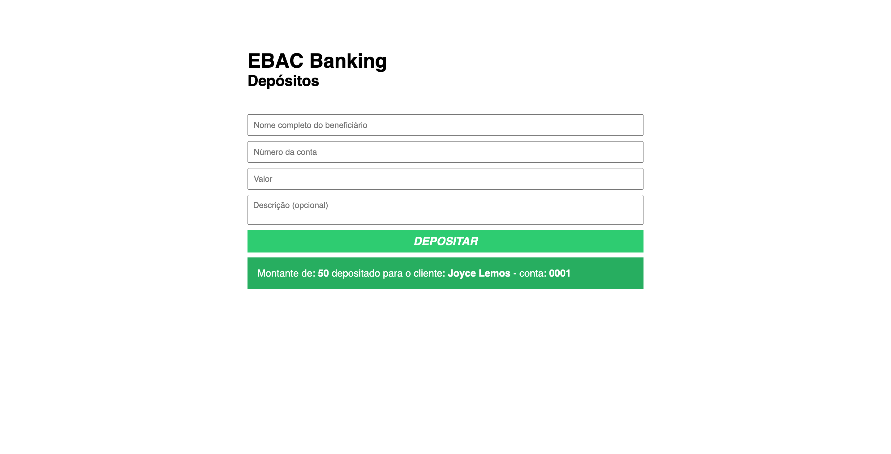

<h4>:open_book: EBAC - Escola Britânica de Artes Criativas e Tecnologia 
    💻 Front-End Software Engineering
</h4>

<h1>🏦 EBAC Banking 🏦</h1>

This repository contains the HTML, CSS, and JavaScript code for a web page that allows users to make deposits using the EBAC Banking system. 
The index.html file in this repository represents a deposit form for the EBAC Banking system. It includes fields for the beneficiary's name, account number, deposit amount, and an optional description. Upon submitting the form, the provided information is validated, and a success message is displayed if the deposit is successful.  

<h3>:rocket: Getting Started</h3>

To use the EBAC Banking deposit form, follow these steps: 

1. Clone this repository to your local machine or download the ZIP file. 
2. Open the index.html file in a web browser. 
3. Fill in the beneficiary's name, account number, deposit amount, and an optional description in the corresponding input fields. 
4. Click the "Depositar" (Deposit) button to submit the form. 
5. If the form is valid and the deposit is successful, a success message will be displayed.  

<h3>:hammer: Project structure</h3>

The project structure includes the following files:

• index.html: The main HTML file that contains the deposit form. 
• main.css: The CSS file that styles the HTML elements. 
• main.js: The JavaScript file that handles form validation and submission.  

 <h3>📸 Screenshots</h3>
    
    
