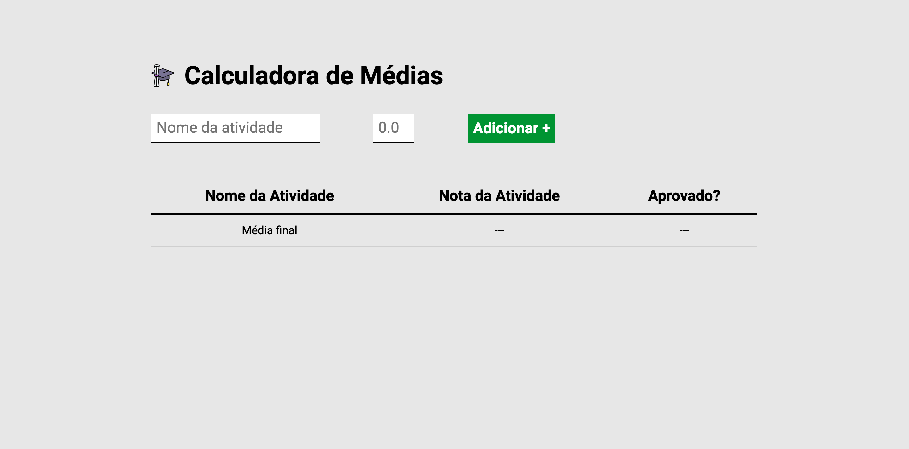
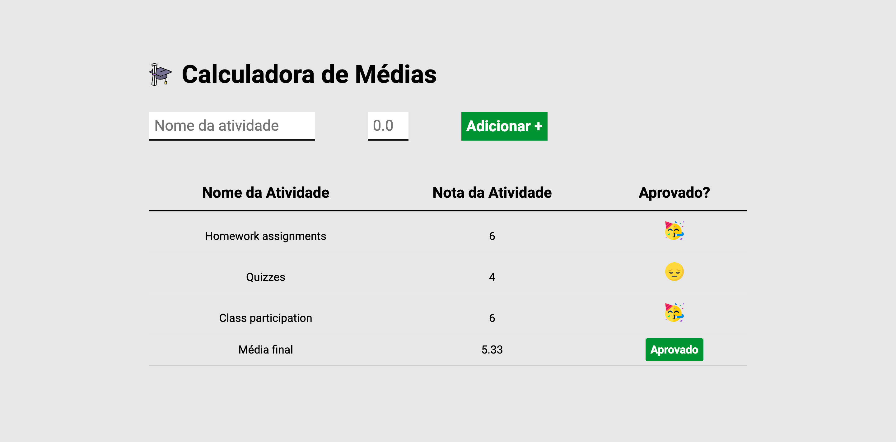

<h4>:open_book: EBAC - Escola Britânica de Artes Criativas e Tecnologia 
    💻 Front-End Software Engineering
</h4>

<h1>🔢 Grade Calculator 🔢</h1>

The Grade Calculator is a web-based tool that helps you manage and calculate your grades for different activities. 
Whether you are a student or a teacher, this application allows you to input the name and grade of each activity and automatically calculates your final grade based on the average. It also indicates whether you have achieved the minimum passing grade.  

<h3>:rocket: Getting Started</h3>

To use the Grade Calculator, follow these steps: 

1. Clone this repository to your local machine or download the ZIP file. 
2. Open the index.html file in your preferred web browser. 
3. Enter the name and grade of each activity in the provided form and click the "Adicionar +" button. 
4. The table will display the list of activities, their corresponding grades, and whether they are approved or not. 
5. The "Média final" row at the bottom shows your final grade average and whether you have passed or not.  

<h3>📸 Screenshots</h3>

1. Unpopulated Fields:

2. Unpopulated Fields:
