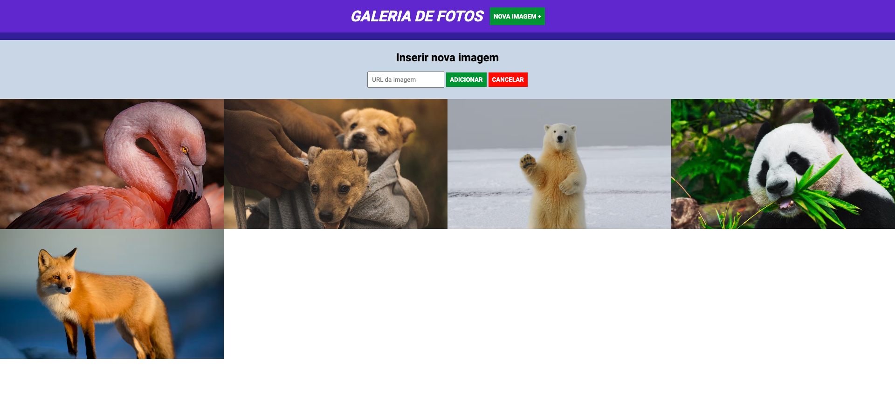

<h4>:open_book: EBAC - Escola Britânica de Artes Criativas e Tecnologia 
    💻 Front-End Software Engineering
</h4> 

<h1>🖼️ Gallery App 🖼️</h1>

Gallery App is a simple and user-friendly gallery application that allows users to effortlessly view and add images. 
With its intuitive interface, users can easily manage their collection of photos, enjoying the ability to view images in full size and conveniently add new images to the gallery. 
Whether you want to showcase your favorite moments or create a visual portfolio, Gallery App provides the perfect platform for organizing and displaying a collection of images with descriptions.  

<h3>:rocket: Getting Started</h3>

To access the Gallery App application, follow these steps:

<ol>
    <li>Clone the repository to your local machine.</li>
    <li>Open the index.html file in your preferred web browser.</li>
    <li>The gallery will be displayed, showing the existing images.</li>
    <li>To view an image in full size, click on the image or the "Ver imagem em tamanho real" link.</li>
    <li>
        To add a new image to the gallery, follow these steps:
        <ul>
            <li>Click on the "Nova imagem +" button in the header.</li>
            <li>Enter the URL of the image in the input field.</li>
            <li>Click the "Adicionar" button to add the image.</li>
            <li>Click the "Cancelar" button to reset the form.</li>
        </ul>
    </li>
</ol> 

  <h3>🌐 Plugins</h3>

To enhance the functionality and interactivity of Gallery App, we utilized the <a href="https://jquery.com/download/">jQuery library</a>. With jQuery, we achieved dynamic image addition, form interaction handling, and animation effects. The library streamlined the process of managing the gallery, allowing users to view images, add new ones, and enjoy a more interactive and user-friendly experience.

  <h3>📸 Screenshots</h3>
    
    