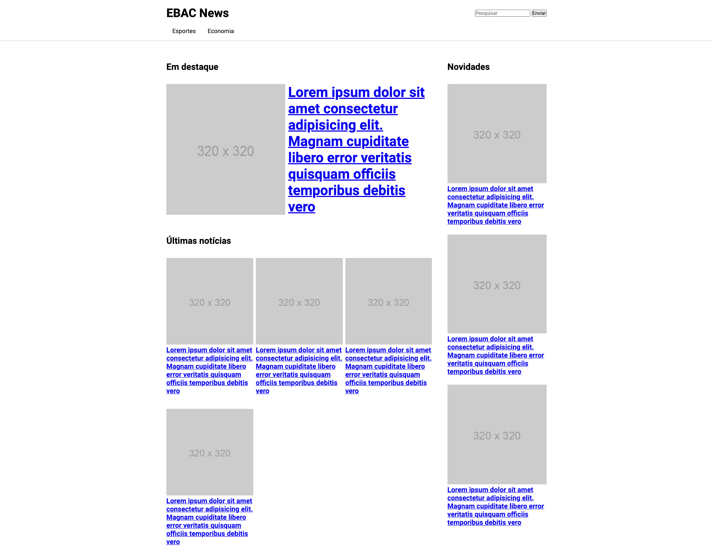
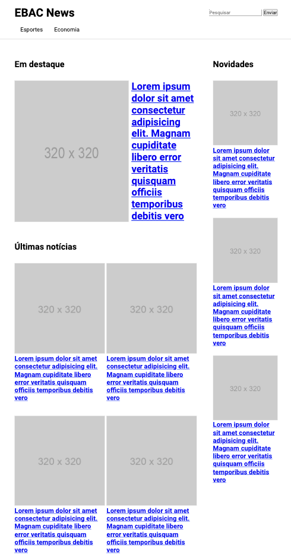
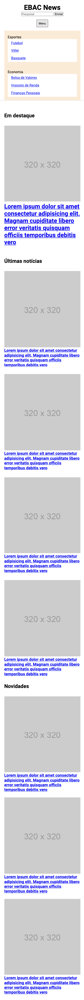

<h4>:open_book: EBAC - Escola Britânica de Artes Criativas e Tecnologia 
    💻 Front-End Software Engineering
</h4>

<h2>Unit 11: </h2>

    • Foundations of Responsive CSS  

<h1>📰 EBAC News 📰</h1>

    Welcome to the News Portal project! This is a simple web page designed to showcase news articles in various categories. 
    The portal features a responsive layout, allowing users to access the latest news and explore different topics conveniently.  

<h3>:rocket: Getting Started</h3>

To access the EBAC News application, follow these steps:

    1. Clone the repository to your local machine.
    2. Open the index.html file in your preferred web browser.
    3. Explore the different sections of the portal, such as featured news and latest updates.

<h3>📲 Responsiveness</h3>

The News Portal has been developed with a focus on responsiveness. This means that the web page adapts to different screen sizes and devices, ensuring an optimal user experience. 
Whether you're accessing the portal from a desktop, tablet, or mobile phone, the layout will adjust accordingly, providing readability and usability. 

The responsive design includes: 

  • Fluid layout: The elements on the page resize proportionally to fit the screen, ensuring content remains visible and accessible.
        
  • Mobile-friendly navigation: On smaller screens, the navigation menu transforms into a mobile-friendly dropdown menu, allowing easy access to different categories.
        
  • Flexible media: Images and other media elements adjust their size and placement to maintain a visually appealing layout on different devices.
        
  • Media queries: CSS media queries have been utilized to apply specific styles and layout adjustments for different screen sizes, optimizing the user experience across devices.  

  <h3>🌐 Plugins</h3>

  The web page includes a reference to the <a href="https://jquery.com/download/">jQuery library</a>, enabling the smooth opening and closing of the menu button. 
  This is achieved by using a jQuery function to assign a click event to the button, triggering a slide toggle effect on the menu element for a seamless user experience.

  <h3>📸 Screenshots</h3>
    
    
    
