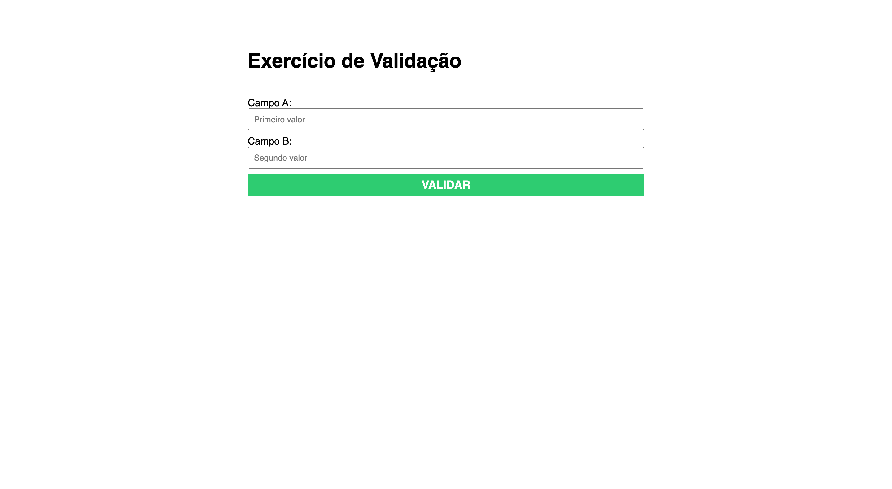
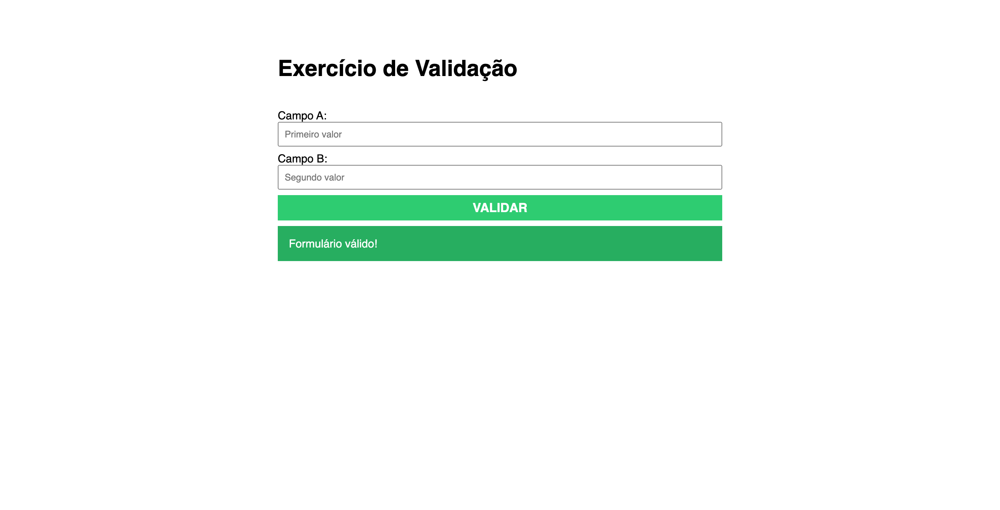
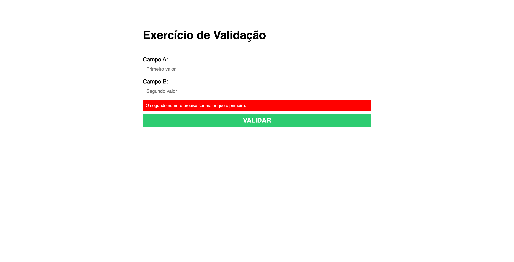

<h4>:open_book: EBAC - Escola Britânica de Artes Criativas e Tecnologia 
    💻 Front-End Software Engineering
</h4>

<h2>Task 7: </h2>

  • Create an HTML form with two numeric fields, field A and field B, and a button to submit the form. 
  • Implement a validation in JavaScript, where the form will be valid if number B is greater than number A. 
  • Display a positive message when the form is valid and a negative message when it is invalid.

  

<h1>🔎 Validating Form Inputs 🔎</h1>

  This is a simple web application that demonstrates how to validate form input using JavaScript. 
  It consists of an HTML file that contains a form with two input fields, and a JavaScript file that checks whether the second input field is greater than the first one.  
  ✅ If the second input is greater than the first one, the form will be submitted successfully and a success message will be displayed on the screen.  
  ❌ If the second input field is less than or equal to the first one, an error message is displayed, and the form is prevented from being submitted. 

1. Unpopulated Fields:
   

2. Success Message:
   

3. Error Message:
   

  
<h3>:clipboard: Requirements</h3>

  Web browser (Chrome, Firefox, Safari, Edge, etc.)  

<h3>:joystick: How to Use</h3>

  1. Open index.html in your web browser. 
  2. Enter a value in campoA. 
  3. Enter a value in campoB. 
  4. Click the Validar button.  

<h3>:thought_balloon: Expected Behavior</h3>

  If the value in campoB is greater than the value in campoA, a success message will be displayed: Formulário válido!. 
  If the value in campoB is less than or equal to the value in campoA, an error message will be displayed: O segundo número precisa ser maior que o primeiro.  

<h3>:file_folder: Files Included</h3>

  • index.html: the HTML file for the web page. 
  • style.css: the CSS file for the web page. 
  • main.js: the JavaScript file for the form validation. 

