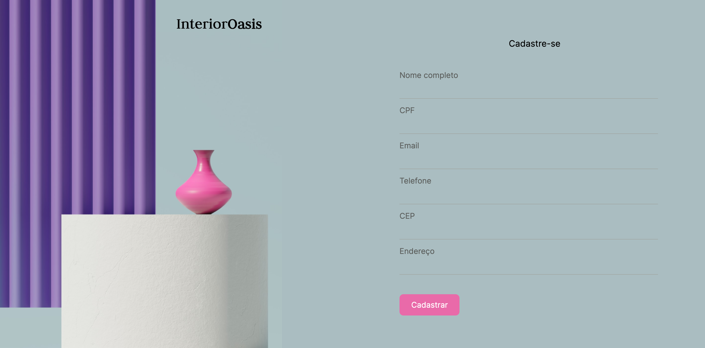

<h4>:open_book: EBAC - Escola Britânica de Artes Criativas e Tecnologia 
    💻 Front-End Software Engineering
</h4>

<h2>Task 10: </h2>

    • Create a registration form, this form should include the fields: full name, email, telephone, National Insurance number, full address, and postcode 
    • Use the jQuery Mask Plugin to apply masks to the National Insurance number, telephone, and postcode fields. 

 

<h1>🛋 Interior<b>Oasis</b> 🛋</h1>

   This repository contains the code for the sign-up page of InteriorOasis, a decor store. The sign-up page allows users to create an account by filling out the following fields: 

    • Full Name: Users need to provide their full name.
    • CPF: Users need to enter their CPF (Brazilian Individual Taxpayer Registry) number.
    • Email: Users need to provide a valid email address.
    • Phone Number: Users need to enter their phone number.
    • CEP: Users need to provide a valid postal code (CEP stands for "Código de Endereçamento Postal" in Brazil).
    • Address: Users need to enter their complete address.

The page utilizes the jQuery Mask Plugin to enhance the user experience. The plugin is used to format and validate specific input fields:

    • The CPF field is masked as "000.000.000-00" to ensure the correct format.
    • The Phone Number field is masked as "(00) 0000-0000" to enforce the phone number format.
    • The CEP field is masked as "00000-000" to ensure the correct postal code format.

1. Unpopulated Fields:
   

2. Fields Populated with jQuery Mask Plugin:
   

<h3>:rocket: Getting Started</h3>

To access the EBAC Motors application, follow these steps:

    1. Clone the repository to your local machine.
    2. Open the index.html file in your preferred web browser.
    3. The page will be displayed on the page, showcasing all the page and form.

<h3>:hammer: Project structure</h3>

The project has the following structure:

    • index.html: The main HTML file that contains the sign-up page.
  
    • styles/: Directory containing CSS files.
  
    • js/jquery.mask.min.js: Plugin for input field masking.

    • js/main.js: JavaScript file for initializing the plugin and other functionalities.

    • README.md: This file providing an overview of the project.
  
    • images/: Contains all the images used in the web page.
  
  Together, these codes create a dynamic web form with enhanced functionality.  

<h3>🌐 Plugins</h3>

<a href="https://igorescobar.github.io/jQuery-Mask-Plugin/">jQuery Mask Plugin:</a> 
The jQuery Mask Plugin allows you to easily apply masks to input fields, such as phone numbers or dates, providing a predefined format for data entry. Include the jQuery and plugin libraries, select the input field, and apply the desired mask using provided patterns. 

