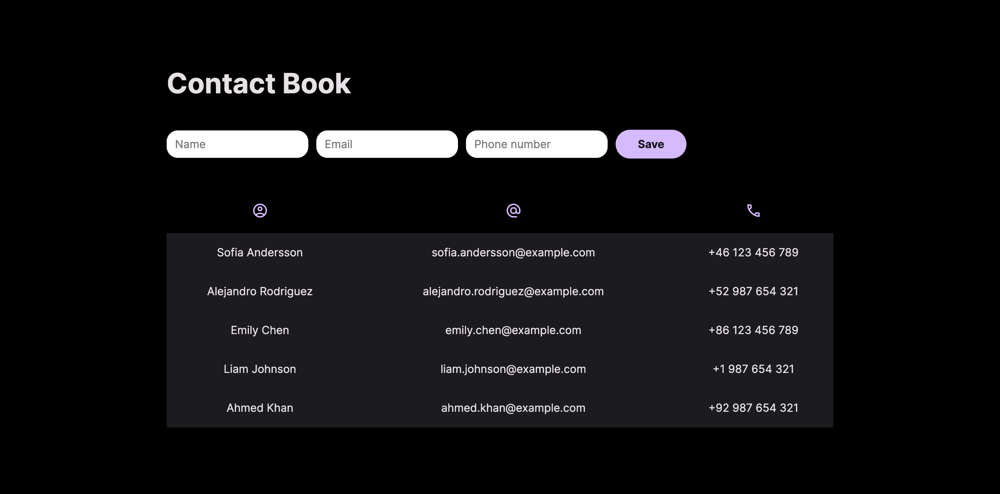

<h4>:open_book: EBAC - Escola Britânica de Artes Criativas e Tecnologia 
    💻 Front-End Software Engineering
</h4>
<h2>Task 8: </h2>

    • Create a contact book

 

<h1>☎ Contact Book ☎</h1>

Contact Book is a web application that allows users to save their contacts, including their name, email, and phone number.  
Users can add new contacts and view their existing contacts in a table format.  

<h3>:rocket: Getting Started</h3>

    To use Contact Book, simply download or clone the repository and open the index.html file in your web browser.  
    git clone https://github.com/joycelemos73/EBAC-FrontEnd/tree/exercicio_projeto02/contactBook 
    cd contactBook 
    open index.html  
    Alternatively, you can view the live version of tha page at https://contact-book-red.vercel.app/
      

<h3>:art: Design</h3>

  The design for this project was created using Figma. 
  You can view the design and layout by following this <a href="https://www.figma.com/file/NnhuxBTV26zdSXNWGIU1zH/Untitled?type=design&node-id=0%3A1&t=1AgSv2bOqrM8Fixc-1">link</a>. 
  The design includes the color scheme, typography, and layout used throughout the project. 
  If you have any feedback or suggestions for improvement, please let me know!  

<h3>💻 Usage</h3>

  • To add a new contact, simply fill out the form with the contact's name, email, and phone number, and click the "Save" button. 
  • The new contact will be added to the table. 
  • To view existing contacts, simply look at the table. The table shows the contact's name, email, and phone number.  

<h3>:hammer: Built With</h3>
<ul>
    <li>HTML</li>
    <li>CSS</li>
    <li>JavaScript</li>
</ul>

