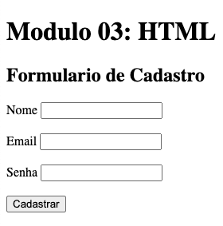

<h4>
  :open_book: EBAC - Escola Britânica de Artes Criativas e Tecnologia 
  💻 Front-End Software Engineering 
</h4>
 

<h2>Task 03: </h2>

    • Create an HTML file that contains a registration form with the fields name, email, and password, and the presence of a button to perform the registration.

 
    