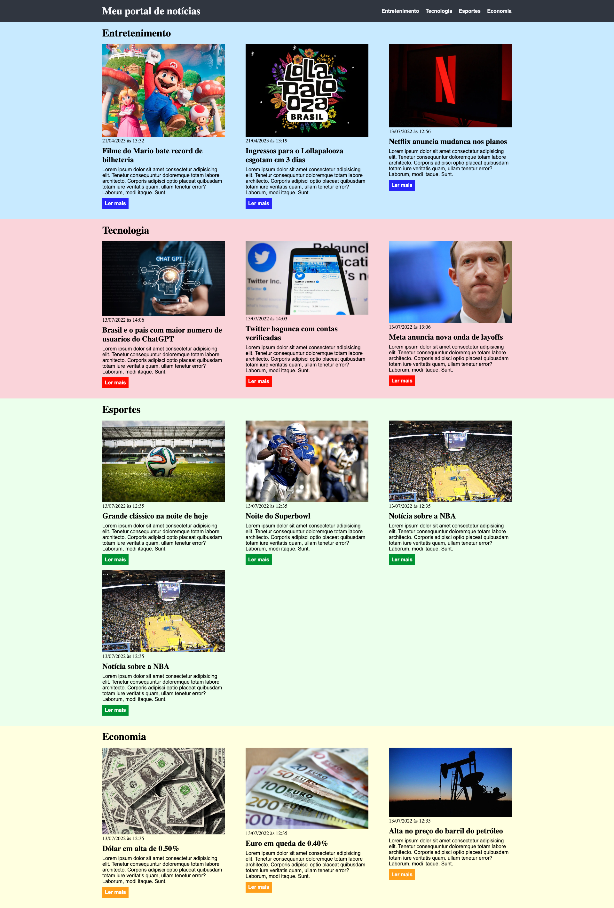

<h4>📖EBAC - Escola Britânica de Artes Criativas e Tecnologia 
    💻Front-End Software Engineering
</h4>
 
<h2>Task 4: </h2>

    • Create two more sections in the layout that was created class.  
    • The new sections should contain other pieces of news and different colours. 

